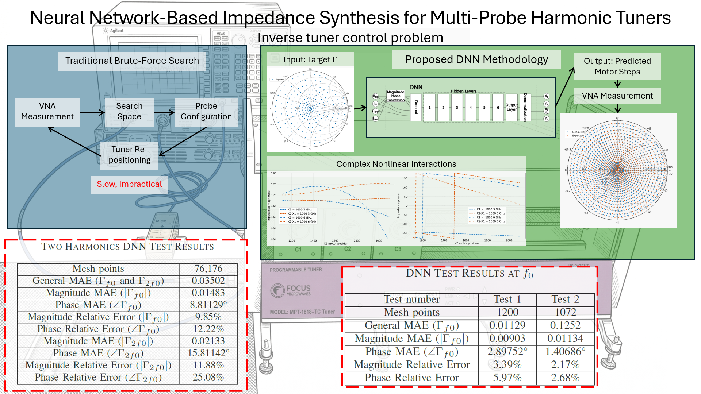
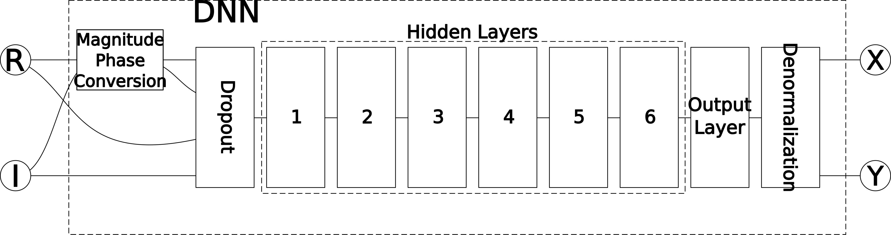
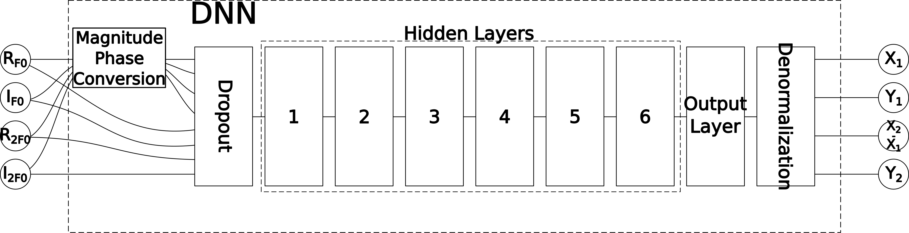
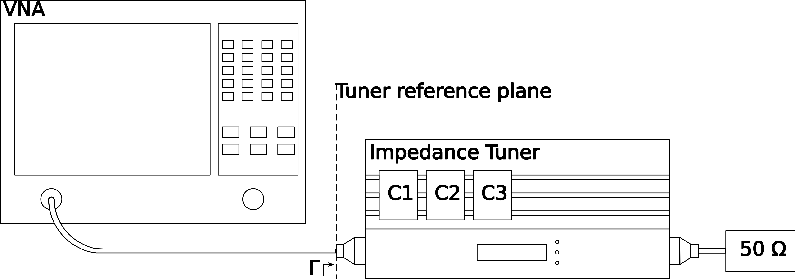

# Neural Network-Based Impedance Synthesis for Multi-Probe Harmonic Tuners



## Description

This work presents a deep neural network (DNN) approach to solve the inverse tuner control problem in multi-probe harmonic impedance tuners used in RF Load-Pull measurements. In this problem, the desired reflection coefficients at the tuner reference plane are specified and the corresponding probe positions must be determined. 

The proposed methodology addresses the complex nonlinear interactions inherent in multi-probe systems, where the movement of a single probe shifts the impedance across multiple harmonics, rendering traditional brute-force search methods impractical due to the large number of possible probe configurations. Two feedforward DNN architectures featuring six hidden layers were designed and trained to predict the motor steps required to synthesize target impedances at the tuner reference plane. 

By replacing iterative VNA-based searches with a predictive model, the proposed approach significantly reduces tuner pre-characterization time and improves the efficiency of RF transistor Load-Pull measurements.

---

## Project Structure

The project directory is structured as follows:

- **Root Directory**:
  - `Single_frequency.py`: Inference script for the single-frequency model (1H).
  - `Dual_frequency.py`: Inference script for the dual-frequency model (2H).
- **`Scripts/`**:
  - `models.py`: Defines the PyTorch neural network classes (`SingleFrequencyModel` and `DualFrequencyModel`).
  - `utils.py`: Includes utility functions for automatic device assignment (CUDA or CPU), CSV loading, and weight remapping.
- **`Models/`**:
  - `NN_Single_frequency/`: Directory containing pre-trained weight and bias CSV matrices for the 1H model.
  - `NN_Dual_frequency/`: Directory containing pre-trained weight and bias CSV matrices for the 2H model.
- **`Inputs/`**:
  - `input_data_1h.csv` & `input_data_2h.csv`: Input CSV datasets containing the Real and Imaginary components used as neural network inputs.

- **`Outputs/`**:
  - `predictions_1h.csv` & `predictions_2h.csv`: CSV prediction files containing the synthesized motor steps.
- **`Images/`**:
  - `Graphical_Abstract.png`: Comprehensive visual summary of the project.
  - `Banco_Tuner.png`: Practical setup configuration showing VNA and tuner connections.
  - `Arq_RNA_F0_res.png`: Neural Network architecture configuration for the 1H model.
  - `Arq_RNA_2F0_res.png`: Neural Network architecture configuration for the 2H model.

---

## Main Libraries and Requirements

The inference code is written in Python. The principal dependencies required to run the scripts are:
- **`python`** (>= 3.8)
- **`pytorch`** (>= 2.0.0)
- **`pandas`**
- **`numpy`**
- **`openpyxl`** (required by pandas for Excel reading)

You can install all necessary packages via pip:
```bash
pip install torch pandas numpy openpyxl
```

---

## Usage Instructions

To synthesize tuner motor positions using the predictive models, follow these steps:

### Step 1: Input Setup
Place your input datasets inside the `Inputs/` folder as CSV files:
* **For Single Frequency (1H)**: The dataset must be saved as `Inputs/input_data_1h.csv`. The file should contain two columns representing the Real and Imaginary components (column 0 is `Real` and column 1 is `Imaginary`).
* **For Dual Frequency (2H)**: The dataset must be saved as `Inputs/input_data_2h.csv`. The file should contain four columns representing the Real and Imaginary components of both the fundamental and the second harmonic: `Real_1H`, `Imag_1H`, `Real_2H`, `Imag_2H`.


### Step 2: Running Inference
Run the inference scripts from the root of the `Git` directory:

* **Single Frequency Inference**:
  ```bash
  python Single_frequency.py
  ```
  This script will load the weights from `Models/NN_Single_frequency`, run predictions, and save the resulting motor coordinates to `Outputs/predictions_1h.csv` (columns `X1`, `Y1`).

* **Dual Frequency Inference**:
  ```bash
  python Dual_frequency.py
  ```
  This script will load the weights from `Models/NN_Dual_frequency`, execute the neural network, compute absolute `X2` values by adding `X1` to column 2, and write predictions to `Outputs/predictions_2h.csv` (columns `X1`, `Y1`, `X2`, `Y2`).

---

## System Architecture

### Single Frequency Model (1H)


### Dual Frequency Model (2H)


---

## Experimental Setup & Tuner Control

The generated output CSV files contain the precise motor steps predicted by the model. 



### Practical Validation Steps:
1. **Send Positions**: Read the predicted motor positions (`X1, Y1` or `X1, Y1, X2, Y2`) from the output CSV files inside the `Outputs/` folder and send them to the **Focus Microwaves iMPT-1818-TC** multi-probe harmonic impedance tuner using its control interface.
2. **Measurement**: Perform measurements at the input plane of the tuner using a **Vector Network Analyzer (VNA)**:
   * **For 1H**: Measure reflection coefficients at **3 GHz**.
   * **For 2H**: Measure reflection coefficients at **3 GHz** and **6 GHz** simultaneously.
3. **Calibration Note**: A calibration must be performed beforehand on the RF path and cables to ensure the VNA measurements accurately reach the reference plane of the impedance tuner.
